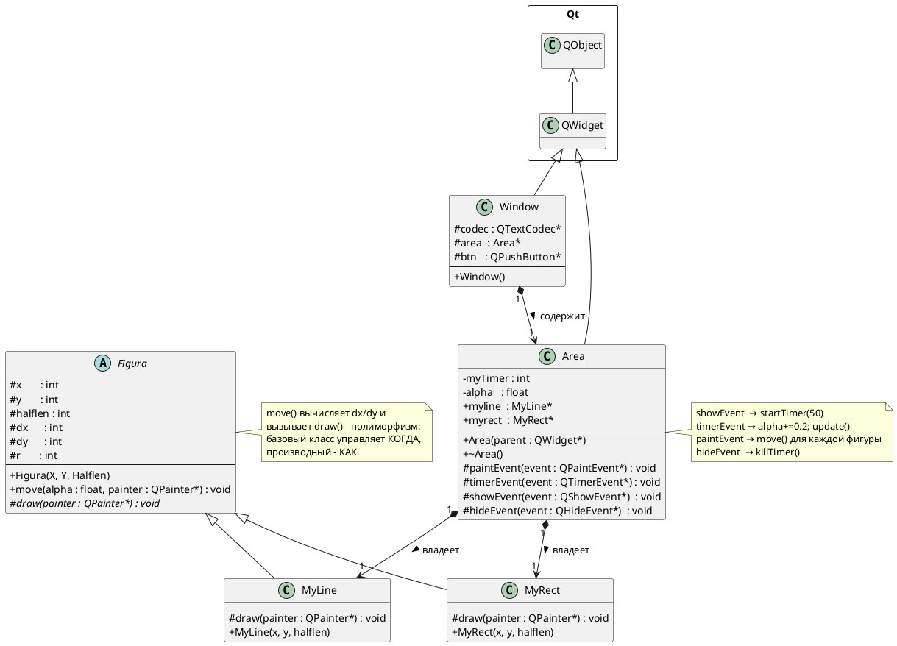

# Лабораторная работа №1 - «Движущиеся изображения»

## Постановка задачи

Разработать Qt-приложение, в окне которого непрерывно вращаются вокруг своих
геометрических центров два объекта: **линия** и **квадрат**. Линия вращается
с угловой скоростью 1×, квадрат - вдвое медленнее и в обратную сторону.

Анимация реализована через системный таймер Qt: каждые 50 мс (≈20 кадров/с)
накапливается угол поворота и планируется перерисовка холста. Таймер запускается при
показе холста и останавливается при его скрытии.

В архитектуре применяется **полиморфизм**: абстрактный класс `Figura` описывает
общую логику движения, а конкретные классы `MyLine` и `MyRect` реализуют метод
рисования `draw()`.

---

## UML-диаграмма классов (PlantUML)



## Описание классов

### `Figura` (абстрактный)

**Назначение:** общий интерфейс и логика движения для всех фигур.

**Поля:** координаты центра (`x`, `y`), полуразмер (`halflen`), текущие смещения
(`dx`, `dy`) - вычисляются в каждом кадре.

**`move(alpha, painter)`:** вычисляет `dx = halflen·cos(alpha)`, `dy = halflen·sin(alpha)`,
затем вызывает виртуальный `draw()`. Это **шаблонный метод** (Template Method): базовый
класс задаёт алгоритм, производный - конкретные шаги.

**`draw(painter)`:** чисто виртуальный - реализация в каждом наследнике своя.

---

### `MyLine`

**Назначение:** линия, вращающаяся вокруг центра.

**`draw()`:** один отрезок между точками `(x+dx, y+dy)` и `(x-dx, y-dy)` -
симметрично относительно центра.

---

### `MyRect`

**Назначение:** квадрат, вращающийся вокруг центра.

**`draw()`:** четыре ребра между вершинами, полученными поворотом вектора `(dx, dy)` на
0°, 90°, 180°, 270°. При `alpha = 0` выглядит как ромб; при вращении - как квадрат.

---

### `Area`

**Назначение:** холст, на котором живут и анимируются фигуры. Управляет таймером и
обрабатывает четыре типа событий Qt.

| Событие | Действие |
|---------|---------|
| `showEvent` | `startTimer(50)` - запустить таймер |
| `timerEvent` | `alpha += 0.2; update()` - накопить угол, запросить перерисовку |
| `paintEvent` | создать `QPainter`, нарисовать обе фигуры |
| `hideEvent` | `killTimer(myTimer)` - остановить таймер |

---

### `Window`

**Назначение:** главное окно. Размещает `Area` и кнопку «Завершить» в вертикальном
layout, соединяет кнопку со слотом `close()`.

---

## Структура файлов

```
lab1.pro     - проектный файл qmake
figura.h/cpp - классы Figura, MyLine, MyRect
area.h/cpp   - класс Area (холст с анимацией)
window.h/cpp - класс Window (главное окно)
main.cpp     - точка входа
```

## Сборка и запуск

```bash
qmake lab1.pro
make
./lab1
```

Требования: Qt 5.x, компилятор с поддержкой C++17.
