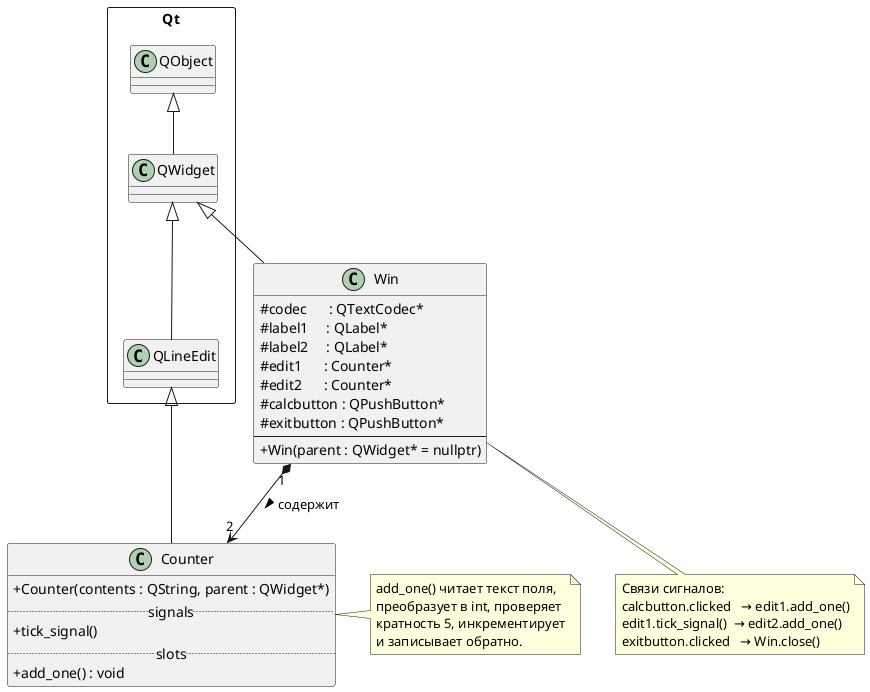

# Лабораторная работа №1 - «Счётчик»

## Постановка задачи

Разработать оконное Qt-приложение, которое считает одиночные нажатия кнопки и
автоматически фиксирует каждую завершённую серию из пяти нажатий. В окне два
счётчика:

- **Счёт по 1** - увеличивается на 1 при каждом нажатии кнопки «+1»;
- **Счёт по 5** - увеличивается на 1 каждый раз, когда первый счётчик достигает
  очередного кратного пяти значения.

Взаимодействие между объектами реализовано через механизм сигналов и слотов Qt:
первый счётчик генерирует собственный сигнал `tick_signal()`, который подключён к
слоту второго счётчика. Объекты не зависят друг от друга напрямую.

---

## UML-диаграмма классов (PlantUML)



## Описание классов

### `Counter`

**Назначение:** визуальный счётчик с бизнес-логикой внутри. Наследует `QLineEdit`,
используя его как готовое поле отображения числа - нет необходимости рисовать
виджет с нуля.

**Сигнал `tick_signal()`:** испускается слотом `add_one()` каждый раз, когда
текущее значение счётчика кратно 5 (и не равно 0 - чтобы не стрелять при самом
первом нажатии). Никакой логики внутри сигнала нет - тело генерирует MOC.

**Слот `add_one()`:** читает строку из поля через `text()`, преобразует в `int`
через `toInt()`, проверяет условие и испускает сигнал, затем инкрементирует и
записывает результат обратно через `setText()`.

---

### `Win`

**Назначение:** главное окно приложения. Создаёт и компонует все виджеты,
устанавливает три сигнально-слотовых соединения. Собственной бизнес-логики
не содержит - всё делегировано объектам `Counter`.

**Компоновка:** три горизонтальных `QHBoxLayout` (подписи / поля / кнопки),
объединённых в один вертикальный `QVBoxLayout`.

---

## Структура файлов

```
lab1.pro    - проектный файл qmake
win.h       - объявления классов Counter и Win
win.cpp     - конструктор Win
main.cpp    - точка входа
```

## Сборка и запуск

```bash
qmake lab1.pro
make
./lab1
```

Требования: Qt 5.x, компилятор с поддержкой C++17.
