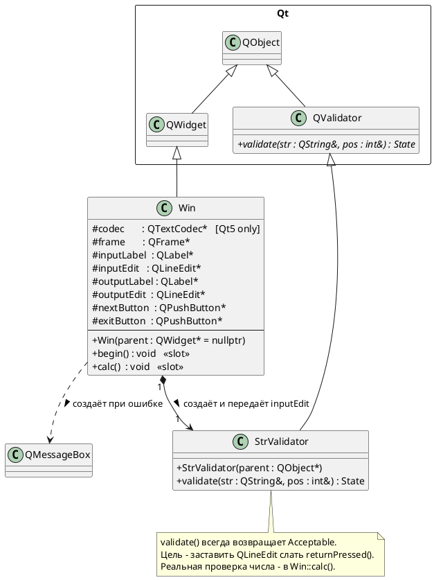

# Лабораторная работа №1 - «Возведение числа в квадрат»

## Постановка задачи

Разработать оконное Qt-приложение, которое принимает от пользователя вещественное
число, вычисляет его квадрат и выводит результат. Приложение должно:

- блокировать поле ввода после получения результата (чтобы отображаемый результат
  всегда соответствовал введённым данным);
- активировать кнопку **«Следующее»** только после успешного вычисления;
- сообщать об ошибке через диалоговое окно, если пользователь ввёл не число;
- возвращаться в начальное состояние по нажатию **«Следующее»**.

Завершение ввода фиксируется нажатием **Enter** - для этого используется
пользовательский валидатор, унаследованный от `QValidator`.

---

## UML-диаграмма классов (PlantUML)



## Описание классов

### `Win`

**Назначение:** главное окно приложения - управляет всем пользовательским интерфейсом
и содержит бизнес-логику (вычисление квадрата).

**Наследование:** `QWidget` → предоставляет окно с системными декорациями
(заголовок, рамка, кнопки сворачивания/закрытия).

**Ключевые поля:**

| Поле          | Тип             | Назначение                                       |
|---------------|-----------------|--------------------------------------------------|
| `codec`       | `QTextCodec*`   | Преобразование кодировок (только Qt 5)           |
| `frame`       | `QFrame*`       | Декоративная рамка вокруг полей ввода/вывода     |
| `inputEdit`   | `QLineEdit*`    | Поле ввода числа                                 |
| `outputEdit`  | `QLineEdit*`    | Поле отображения результата                      |
| `nextButton`  | `QPushButton*`  | Кнопка сброса в режим ввода                      |
| `exitButton`  | `QPushButton*`  | Кнопка завершения приложения                     |

**Ключевые методы:**

- **`Win(parent)`** - конструктор: создаёт и позиционирует все виджеты через layout-менеджеры,
  подключает сигналы к слотам, вызывает `begin()` для первоначальной настройки.

- **`begin()` (слот)** - переводит интерфейс в режим ввода: очищает поля, скрывает результат,
  блокирует кнопку «Следующее», ставит фокус на `inputEdit`.

- **`calc()` (слот)** - читает текст из `inputEdit`, пытается преобразовать в `double`.
  При успехе - вычисляет квадрат и переключает интерфейс в режим вывода.
  При ошибке - показывает `QMessageBox`.

---

### `StrValidator`

**Назначение:** вспомогательный валидатор, единственная цель которого - разрешить `QLineEdit`
генерировать сигнал `returnPressed()` по нажатию Enter в любом случае.

**Наследование:** `QValidator` → абстрактный класс Qt для проверки вводимых данных.

**Метод `validate(str, pos)`:**
Всегда возвращает `QValidator::Acceptable`. Это говорит `QLineEdit`: «строка корректна,
можно слать сигналы завершения ввода». Реальная валидация (является ли строка числом)
выполняется позже, в `Win::calc()`.

---

## Структура файлов

```
lab1.pro    - проектный файл qmake
win.h       - объявления классов Win и StrValidator
win.cpp     - реализация методов
main.cpp    - точка входа
```

## Сборка и запуск

```bash
qmake lab1.pro
make
./lab1
```

Требования: Qt 5.12+
